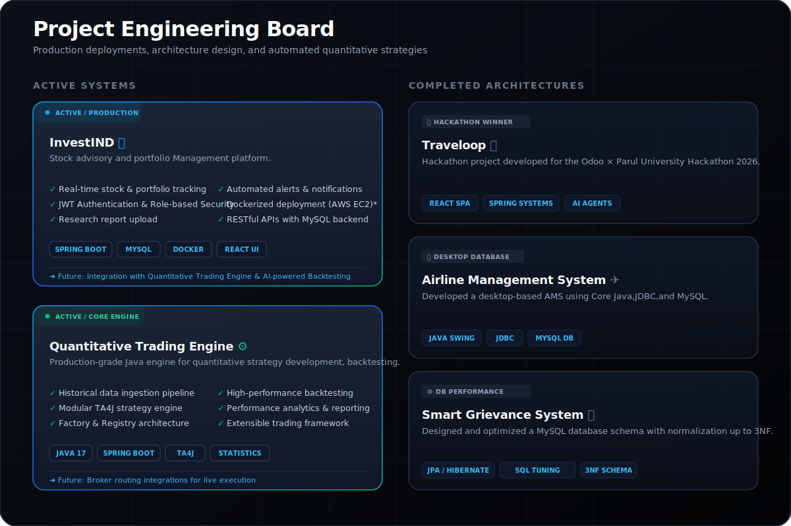

<!-- 🔷 Banner -->

  

  

  

  

  

## 🚀 About Me

  I am a passionate <b>Java Backend Developer</b> and <b>Spring Boot Developer</b> pursuing my B.Tech in <b>Computer Science (Artificial Intelligence)</b> at <b>Parul University</b>, India. 
  My work centers around designing robust, scalable backend architectures, building production-grade enterprise services, and exploring automated, high-frequency quantitative financial trading applications. I am actively refining my understanding of high-throughput system designs, WebSocket integrations, caching mechanisms, and microservice topologies.

  <b>💼 Career Focus:</b> Scalable Backend Systems • Automated Trading Algorithms • AWS EC2, Docker and CI/CD

  📧 Reach me directly at: <a href="mailto:rithishchowdary783@gmail.com"><b>rithishchowdary783@gmail.com</b></a>

  

## 🌐 Connect With Me

  
  

  

## 🛠️ Tech Stack

  

  
  
  
  

### 🌱 Currently Learning

  
  
  
  
  

  

  

  

## 📌 Active & Completed Systems

  

  

  
  

  

  

## 📊 GitHub Activity

  I’m actively building backend systems, APIs, and automation-focused projects while continuing to expand my skills in distributed systems and financial technology.

## 👀 Profile Views

  

 

  <b>Rithish Chowdary</b> 
  📧 rithishchowdary783@gmail.com |🎓 Parul University | B.Tech CSE (AI)  
  Java Backend Engineer • AI & Quantitative Trading

  

